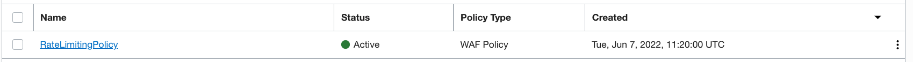
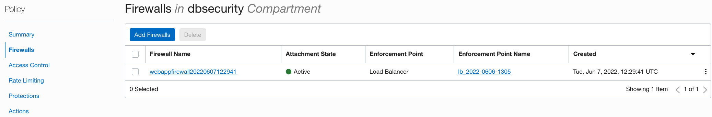
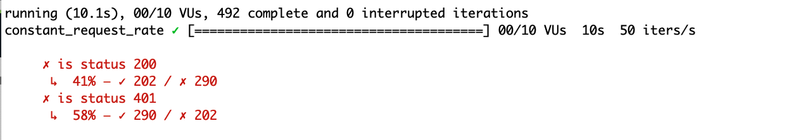

# Enable WAF

## Overview

This task show how to setup a front-end protection ahead the Load Balancer for ORDS servers based on Oracle Web Application Firewall (WAF), to protect applications from malicious and unwanted internet traffic with a cloud-based global web application firewall service.

Estimated Time: 10 minutes

Watch the video below for a quick walk through of the lab.

[](youtube:XYZABC)

### Objectives

* WAF setup

### Prerequisites

* The Oracle Autonomous Transaction Processing database named **TO BE FIXED DB1 (created in Lab X)**

## Task 1: Set a Web Application Firewall Policy

* Get compartment name in order to set the required IAM Policies to enable and use WAF:

    ```bash
    <copy>
       export COMP_NAME=$(oci iam compartment get --compartment-id $TF_VAR_compartment_ocid --query data.name --raw-output)
    </copy>
    ```


* in **Compartment**, set **Policy** needed for Web Application Firewall:

    ```text
    <copy>
    Allow group-id to manage waas-family in compartment-id
    Allow group-id to manage web-app-firewall in compartment-id
    Allow group-id to manage waf-policy in compartment-id
    Allow group-id to use waf-network-address-list in compartment-id
    </copy>
    ```

    i.e. execute these commands **TO BE FIXED and move in a waf-setup.sh script, change Administrators with the UserGroup**:

    ```bash
    <copy>
        export statement="[\"Allow Administrators to manage waas-family in ${COMP_NAME}\",\"Allow Administrators to manage web-app-firewall in ${COMP_NAME}\",\"Allow Administrators to manage waf-policy in ${COMP_NAME}\",\"Allow Administrators to use waf-network-address-list in  ${COMP_NAME}\"]"
        echo "${statement}"  >statement.json
        oci iam policy create --compartment-id $COMP_OCID --name waf_policy --description 'test waf policies' --statements file://./statement.json
        rm ./statement.json
    </copy>
    ```

  **------PART TO BE INCLUDED IN PLATFORM SETUP-------**
    * VCN creation: security_lab_vcn (public+private)
    * For Bastion: follow
        * [Bastion creation](https://blogs.oracle.com/developers/post/how-to-securely-connect-to-private-resources-for-free-via-the-oci-bastion-service)
        * [Bastion plugin](https://medium.com/@harjulthakkar/connect-to-private-compute-instance-using-oci-bastion-service-ca96a3ceea49)
        * [Web Server](https://docs.oracle.com/en/learn/lab_compute_instance/index.html#connect-to-the-instance-and-install-apache-http-server)
        * setup LB with backend set ORDS
        * Set ingress rule on public_vcn for port 80
        
  **------PART TO BE INCLUDED IN PLATFORM SETUP-------**
* WAF:

    * Let's enable a Rate Limit on the http request to pass to Load Balancer in order to avoid a Denial-of-Service attack. Set the Load Balancer IP:
            
            ```
            <copy>
                export LB='XX.XX.XX.XX'
            </copy>
            ```

    * resource to protect {url}/get : http://$LB/get/status.json

        * Conditions
            * Condition Type: Path
            * Operator: Contains
            * Value: get
        * Rate Limiting Configuration
            * Request Limit: 20
            * Perion in Seconds: 1
        * Action Name:
            * "Pre-configured 401 Response Code Action"
        
        ```
        <copy>

            export web_app_firewall_policy_id=$(oci waf web-app-firewall-policy create --compartment-id $TF_VAR_compartment_ocid --display-name RateLimitingPolicy --query data.id --raw-output --actions file://actions.json --request-rate-limiting file://request-rate-limiting.json)

        </copy>
        ```
       Resulting Policy Created:

        

    
    * Add Protection Rule: add basic inspection rules (SQL Injections, etc)

    * Select Enforcement Point:
        * Get the Load Balancer OCID configured:
        ```
        <copy>

        export load_balancer_id=$(oci lb load-balancer list --compartment-id $TF_VAR_compartment_ocid --query 'data[0]."id"' --raw-output )

        </copy>
        ```
    * Attach the policy created at step before to the Load Balancer:
    #ASSIGN POLICY TO LB - WORKS
        ```
        <copy>
        
        oci waf web-app-firewall create-for-load-balancer --compartment-id $TF_VAR_compartment_ocid --load-balancer-id $load_balancer_id --web-app-firewall-policy-id $web_app_firewall_policy_id 
        
        </copy>
        ```
    Check under **Web Application Firewall / Policies / Policy Details** if there is a firewall linked to the policy:

    

## Task 2: Test Rate Limit

Load Test via K6, generating more than Request Limit set on 20, with a script to be run by K6: script.js.

* Download and install K6 in shell:

    ```bash
    <copy>
    cd $SECURIYWORKSHOP_HOME/k6; wget https://github.com/loadimpact/k6/releases/download/v0.27.0/k6-v0.27.0-linux64.tar.gz; tar -xzf k6-v0.27.0-linux64.tar.gz; ln k6-v0.27.0-linux64/k6 k6
    </copy>
    ```

* Prepare a script to load with 50 RPS:

    ```text
    <copy>
       
            import { check } from 'k6';
            import http from 'k6/http';
            export const options = {
                userAgent: 'Mozilla/5.0 (Macintosh; Intel Mac OS X 10_15_7) AppleWebKit/537.36 (KHTML, like Gecko) Chrome/102.0.0.0 Safari/537.36',
            scenarios: {
                constant_request_rate: {
                executor: 'constant-arrival-rate',
                rate: 50,
                timeUnit: '1s', // 50 iterations per second, i.e. 50 RPS
                duration: '10s',
                preAllocatedVUs: 10, // how large the initial pool of VUs would be
                maxVUs: 10, // if the preAllocatedVUs are not enough, we can initialize more
                },
            },
            }
            export default function () {
            const res = http.get(`http://${__ENV.MY_HOSTNAME}/get/status.json`);
                check(res, {
                    'is status 200': (r) => r.status === 200,
                    'is status 401': (r) => r.status === 401,
                });
            }

    </copy>
    ```

* then run to test if WAF is blocking at least half of request that colud be limited to 20 instead 50 arriving: 

    ```bash
    <copy>
    k6 run -e MY_HOSTNAME=$LB ./script.js
    </copy>
    ```

    With a 50 RPS, and a limit of 20, are passed around 40% of requests:

    

## Acknowledgements

* **Author** - Andy Tael, Developer Evangelist;
               Corrado De Bari, Developer Evangelist
* **Last Updated By/Date** - Corrado De Bari, Developer Evangelist