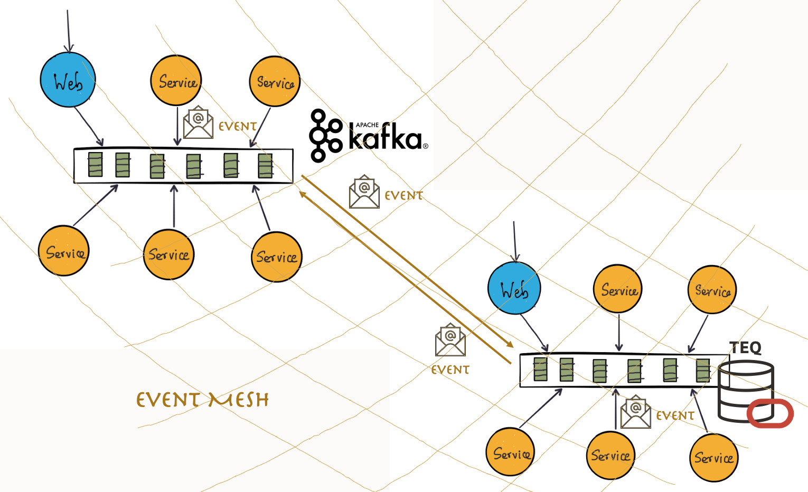

# Simplify Event-driven Apps with TEQ in Oracle Database (with Kafka interoperability) Workshop

## Introduction

### About this Workshop

This workshop will help you understand Event Mesh using two message brokers and the technical capabilities inside the converged Oracle Database to support a scalable event-driven microservices architecture.

You will create four event-driven microservice and two messaging brokers to allow communication between them. In the first lab, you will deploy an Apache Kafka broker to leverage the event-driven communication between two microservices written in Spring Boot. In the second lab, you will create an Oracle Transactional Event Queues (TEQ) and experience the Kafka APIs working in the Kafka compatibility mode. Likewise, this module has the Spring Boot producer and consumer microservices but with Kafka Java client for TEQ, using the okafka library. And finally, in the third lab, you will experiment with the concept of Event Mesh, building a bridge between Kafka and TEQ brokers, and see messages being produced on the Kafka side and consumed on the TEQ side.

Estimated Workshop Time: 50 minutes

> This workshop is part of the [Oracle LiveLabs](https://bit.ly/golivelabs) and you can access it through the following address [TEQ in Oracle Database](https://bit.ly/TEQinOracleDatabase)

### About Product/Technology

* [Oracle Transactional Event Queues](https://docs.oracle.com/en/database/oracle/oracle-database/21/adque/index.html) is a powerful messaging backbone offered by converged Oracle Database that allows you to build an enterprise-class data-centric microservices architecture.

* [Kafka](https://kafka.apache.org) is an open-source distributed event streaming platform used for high-performance data pipelines, streaming analytics, data integration, and mission-critical applications.

* [okafka](https://docs.oracle.com/en/database/oracle/oracle-database/21/adque/Kafka_cient_interface_TEQ.html#GUID-94589C97-F323-4607-8C3A-10A0EDF9DA0D) library, contains Oracle specific implementation of Kafka Client Java APIs. This implementation is built on AQ-JMS APIs.

* The applications will be deployed on [Oracle Cloud Infrastructure](https://www.oracle.com/cloud/) [Cloud Shell](https://docs.oracle.com/en-us/iaas/Content/API/Concepts/cloudshellintro.htm) using pre-installed Docker Engine.

### Objectives

* The first Lab reviews the Kafka and Spring Boot Microservice built to produce and consume messages.

* The second Lab will use Oracle Transactional Event Queues (TEQ) and okafka library and demonstrate the Kafka compatibility of TEQ. Also, this module has the same Spring Boot producer and consumer microservices but uses okafka in place of Kafka libraries and TEQ in the database in place of Kafka broker.

* The third Lab will interconnect the Kafka broker and the Oracle Transactional Event Queues (TEQ), applying Kafka connector and Oracle Database Messaging libraries. This laboratory demonstrates the interoperability between the two brokers, with events flowing from the Kafka side to TEQ, finally consumed at the TEQ side.

### Prerequisites

* This workshop assumes you have an Oracle Cloud Account - Please view this workshop's LiveLabs landing page to see which environments are supported.

>**Note:** If you have a **Free Trial** account, when your Free Trial expires, your account will be converted to an **Always Free** account. You will not be able to conduct Free Tier workshops unless the Always Free environment is available.
**[Click here for the Free Tier FAQ page.](https://www.oracle.com/cloud/free/faq.html)**

## Event Mesh Architecture Overview

As shown in the followed diagram, we have:

* A Kafka Broker and a set of services consuming and producing for it.

* An Oracle TEQ Broker with another set of services around it.

* And connector between Kafka and Oracle TEQ enabling a communication path between them.

You may now **proceed to the next lab**

## Want to Learn More?

* [Multitenant Database–Oracle 19c](https://www.oracle.com/database/technologies/multitenant.html)
* [Oracle Transactional Event Queues](https://docs.oracle.com/en/database/oracle/oracle-database/21/adque/index.html)
* [Microservices Architecture with the Oracle Database](https://www.oracle.com/technetwork/database/availability/trn5515-microserviceswithoracle-5187372.pdf)
* [https://developer.oracle.com/](https://developer.oracle.com/)

## Acknowledgements

* **Authors** - Paulo Simoes, Developer Evangelist; Paul Parkinson, Developer Evangelist; Richard Exley, Consulting Member of Technical Staff, Oracle MAA and Exadata
* **Contributors** - Mayank Tayal, Developer Evangelist; Sanjay Goil, VP Microservices and Oracle Database
* **Last Updated By/Date** - Paulo Simoes, May 2022
